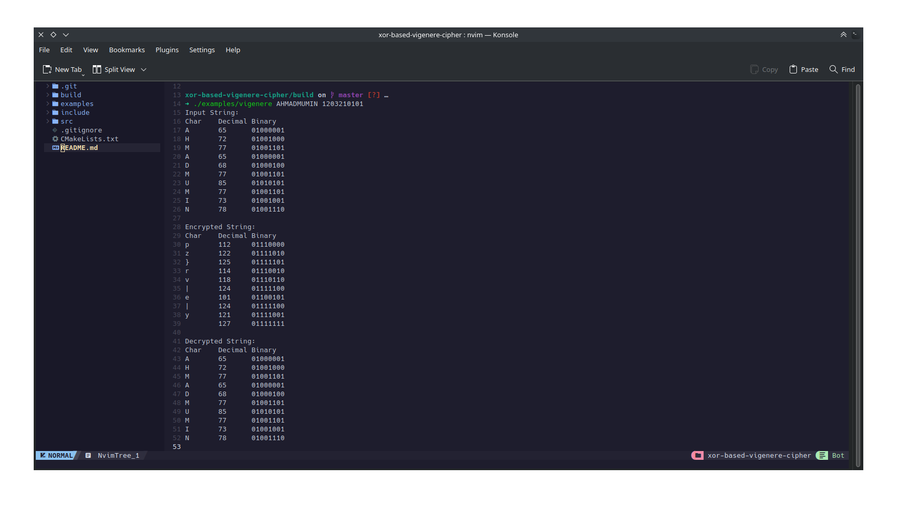
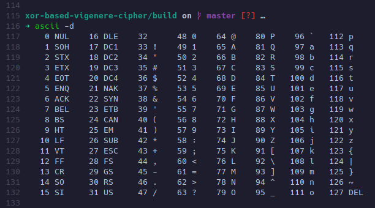

# XOR-based Vigenere Cipher

| Nama        | Ahmad Mu'min Faisal                                 |
| ----------- | --------------------------------------------------- |
| NIM         | 1203210101                                          |
| Kelas       | IF-01-02                                            |
| Link Github | [https://github.com/fzl-22/xor-based-vigenere-cipher](https://github.com/fzl-22/xor-based-vigenere-cipher) |


## 1 Deskripsi

Project ini merupakan project Vigenere Cipher berbasis operasi XOR yang dibuat menggunakan bahasa C dan CMake build system generator. Cipher ini memanfaatkan operasi XOR dari bit-bit setiap karakter dari sebuah plain text dengan bit-bit setiap karakter dari key-nya.

## 2 Cara Menjalankan Program

Pastikan CMake sudah terinstall di sistem operasi. Kemudian, clone repositori project.

```bash
git clone git@github.com:fzl-22/xor-based-vigenere-cipher.git
```

Kemudian, masuk ke direktori project.

```bash
cd xor-based-vigenere-cipher
```

Buat direktori bernama `build` dan navigasi ke folder tersebut.

```bash
mkdir build && cd build
```

Setelah itu, buat Makefile dari file `CMakeLists.txt` dengan perintah berikut.

```bash
cmake -G "Unix Makefiles" ..
```

Setelah selesai, lakukan kompilasi.

```bash
make
```

Terakhir jalankan program dengan format perintah

```
./examples/vigenere <input_string> <key_string>
```

## 3 Percobaan

Sebagai percobaan, jalankan program dengan input dan key berikut:

```
INPUT : AHMADMUMIN
KEY   : kijasik
```

Karena panjang string `kijasik` harus sama dengan panjang string `AHMADMUMIN`, maka key akan menjadi `kijasikkij`.

Outputnya menjadi seperti berikut:



## 4 Penjelasan

Di dalam program, output karakter dari string yang ditampilkan terbagi menjadi 3 format. Yaitu `Char`, `Decimal`, dan `Binary`. Berikut adalah penjelasan lebih detailnya:

```
Char    : karakter dari string yang diolah oleh program
Decimal : representasi desimal dari karakter terkait di ASCII table.
Binary  : representasi biner dari bilangan desimal terkait
```

Berikut adalah kode ASCII dari desimal 0 hingga 127. Untuk lebih lengkapnya, kunjungi [https://www.ascii-code.com/](https://www.ascii-code.com/).



Sehingga, input string `AHMADMUMIN` akan dicetak seperti berikut:

> Plain text: "AHMADMUMIN"

```bash
Input String:
Char    Decimal Binary
A       65      01000001 # representasi biner dari 65
H       72      01001000 # representasi biner dari 72
M       77      01001101 # dan seterusnya ...
A       65      01000001
D       68      01000100
M       77      01001101
U       85      01010101
M       77      01001101
I       73      01001001
N       78      01001110
```

Karena key-nya adalah `kijasikkij`, maka akan menjadi seperti ini (tidak dicetak oleh program):

> Key: "kijasikkij"

```bash
Key String:
Char    Decimal Binary
k       107     01101011 # representasi biner dari 107
i       105     01101001 # representasi biner dari 105
j       106     01101010 # dan seterusnya ...
a       97      01100001
s       115     01110011
i       105     01101001
k       107     01101011
k       107     01101011
i       105     01101001
j       106     01101010
```

Algoritma enkripsi Vigenere Cipher berbasis XOR (dipanggil dengan fungsi `vigenere_cipher`) akan melakukan operasi XOR dari setiap karakter input string dan key string secara bitwise. Sebagai contoh, ambil karakter ke-6 dari input string (konsekuensinya, akan dilakukan operasi XOR secara bitwise dengan karakter ke-6 dari key string). Sehingga , akan dilakukan operasi bitwise XOR antara karakter `M` dengan `i`.

```bash
M ^ i = 77 ^ 105
      = 01001101 ^ 01101001
      = 00100100 # desimal 36, karakter $
```

Bilangan biner `00100100` merupakan representasi dari bilangan desimal `36`. Dimana dalam ASCII table, nilai desimal `36` merepresentasikan karakter `$`. Proses ini terus berlanjut untuk semua karakter, sehingga akan menampilkan hasil enkripsinya adalah:

> Hasil enkripsi: "*!&#39; 7$>& $"

```
Encrypted String:
Char    Decimal Binary
*       42      00101010
!       33      00100001
'       39      00100111
        32      00100000
7       55      00110111
$       36      00100100
>       62      00111110
&       38      00100110
        32      00100000
$       36      00100100
```

Terdapat hasil yang unik ketika bilangan binernya adalah `00100000` (desimal `32`). Dalam ASCII table, desimal `32` mewakili simbol `SP` atau spasi. Apabila hasil enkripsi ini didekripsi ulangan dengan cara memanggil fungsi `vigenere_cipher` lagi, maka hasil dekripsinya adalah seperti di bawah ini.

> Hasil dekripsi: "AHMADMUMIN"

```
Decrypted String:
Char    Decimal Binary
A       65      01000001
H       72      01001000
M       77      01001101
A       65      01000001
D       68      01000100
M       77      01001101
U       85      01010101
M       77      01001101
I       73      01001001
N       78      01001110
```

Proses dekripsi akan melalui cara yang sama dengan proses enkripsi, yaitu melakukan operasi bitwise XOR pada setiap karakter dari string hasil enkripsi dengan key-nya. Sebagai contoh, ambil karakter ke-6 dari string hasil enkripsi dan key, maka prosesnya adalah sebagai berikut:

```bash
$ ^ i = 36 ^ 105
      = 00100100 ^ 01101001
      = 01001101 # desimal 77, karakter M
```

Sehingga akan didapatkan karakter ke-6 dari string hasil enkripsi kembali menjadi `M`. Proses ini berlanjut untuk semua karakter pada string hasil enkripsi.

> Informasi Tambahan: apabila karakter hasil enkripsi berada pada desimal di luar range 32-127, maka karakter yang berkaitan tidak dapat ditampilkan karena tidak termasuk dalam *ASCII printable characters*. Misalnya, apabila hasil enkripsinya memiliki representasi desimal 9, maka tidak akan ditampilkan karakter (melainkan sebuah spasi horizontal yang cukup lebar). Hal ini dikarenakan desimal 9 merupakan representasi desimal dari HT, yaitu *Horizontal Tab*.

## 5 Kesimpulan

Dengan ini, dapat disimpulkan bahwa Vigenere Cipher berbasis XOR merupakan *symmetric encryption* karena proses enkripsi dan dekripsi tetap menggunakan key yang sama. Modifikasi algoritma enkripsi klasik menjadi enkripsi modern berbasis bit tetap sama secara esensi.
